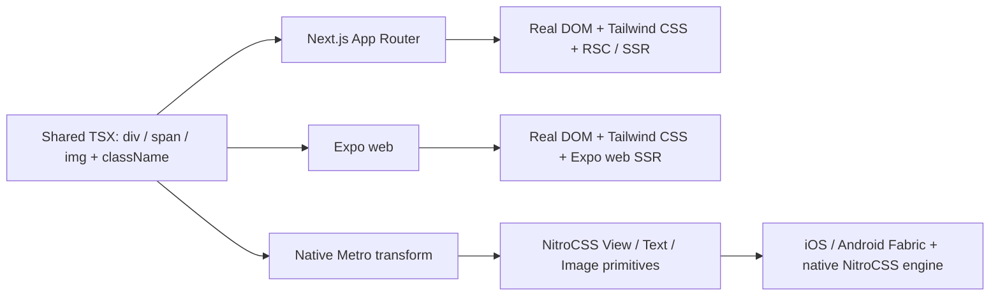

# DOM JSX, Next.js, and Expo Web Plan

## Decision

Nitrowind will support three deliberately different render targets from one
authoring model:

| Target | Authoring result | Styling owner | Runtime required |
| --- | --- | --- | --- |
| Next.js App Router | Real HTML (`div`, `span`, `img`, …) | Browser Tailwind CSS | None for server components |
| Expo web | Real HTML in `.web.tsx` files | Browser Tailwind CSS | Expo Router only |
| iOS / Android | DOM-like JSX compiled to React Native primitives | NitroCSS / Nitrowind | Native NitroCSS engine |

The key constraint is non-negotiable: React Native cannot render browser host
elements. JSX such as `<div />` becomes `React.createElement("div")`, and
`"div"` is not a native React Native host component. The native target needs a
source transform that replaces supported lower-case HTML tags with NitroCSS
components before React Native receives the JSX. The web target must **not**
use that transform: it should retain genuine DOM elements and browser CSS.

Do not use Expo's `'use dom'` feature for SSR pages. It renders embedded web
content as a SPA on native and does not support static rendering or React
Server Components. Use it only later for isolated, native-embedded web
widgets, if needed.

## Goals

1. A developer can write the supported DOM JSX syntax in a shared page:

   ```tsx
   export function ProfileCard() {
     return (
       <article className="rounded-2xl bg-white p-6 shadow">
         
         <h2 className="mt-4 text-xl font-bold">Ash</h2>
         <span className="text-slate-600">Maintainer</span>
       </article>
     );
   }
   ```

2. Next.js and Expo web preserve those elements as browser DOM, use normal
   Tailwind CSS, and can render the page on the server.
3. Native Metro builds convert supported tags to NitroCSS-aware React Native
   components without requiring the author to import `View`, `Text`, or
   `Image`.
4. No Next server component imports the current `@nitrofoundation/nitrowind`
   JavaScript runtime, React Native, Metro code, or native Nitro module.
5. Unsupported HTML semantics fail clearly at build time instead of appearing
   to work while producing an incorrect native UI.

## Non-goals and compatibility limits

- This is not a browser implementation inside React Native. CSS grid, DOM
  layout, forms, browser events, DOM refs, portals, `iframe`, `canvas`, and
  arbitrary HTML custom elements are not automatically portable.
- A plain HTML `<a>` cannot preserve browser navigation semantics on native;
  its native behavior must be explicitly defined.
- A generic `<form>` cannot submit like an HTML form on native.
- The transformation must never run in Next.js, web builds, node/server code,
  `node_modules`, or the Nitrowind/NitroCSS packages themselves.
- This plan does not make client components disappear. A component with
  `useState`, event handlers, browser APIs, or an interactive control still
  needs a client boundary in Next.js. Static pages and server components do
  not.

## Architecture



Keep the three concerns separate:

- **Web CSS entry:** browser-safe CSS only. It adds Tailwind and optional
  browser-valid Nitrowind utilities.
- **Native CSS pipeline:** the existing Metro worker keeps compiling Tailwind
  into NitroCSS serialized style tables for iOS and Android.
- **DOM JSX compiler:** a platform-gated AST transform rewrites tags only for
  native source transforms.

## Phase 0 — contracts and package boundaries

### 0.1 Define the public packages

Keep the existing package as the native product:

- `@nitrofoundation/nitrowind` — React Native runtime, native components,
  compiler, and Metro integration.
- `@nitrofoundation/nitrowind/metro` — native-only Metro wrapper.

Add two narrowly scoped entry points:

- `@nitrofoundation/nitrowind/dom-jsx` — the native-only Babel/Metro JSX
  transform and types. It must not be a browser runtime.
- `@nitrofoundation/nitrowind/next.css` — CSS only. It must have no JavaScript
  export, peer dependency on React Native, or reference to Nitro modules.

`next.css` may expose browser-valid utilities such as the existing safe-area
utilities based on `env(safe-area-inset-*)`. Native-only CSS additions,
including Reanimated helpers and native platform selectors, must not be
exported from this entry.

### 0.2 Define the tag support matrix before implementation

Start with a small, testable set:

| HTML authoring tag | Native output | Native contract |
| --- | --- | --- |
| `div`, `main`, `section`, `article`, `header`, `footer`, `nav`, `aside` | `NitroCss.View` | Block/container semantics only |
| `span`, `p`, `strong`, `em`, `small`, `label` | `NitroCss.Text` | Must remain in a valid native text subtree |
| `h1`–`h6` | `NitroCss.Text` | Apply a documented default typography preset; `className` wins |
| `img` | `NitroCss.Image` | Normalize `src`, require non-empty `alt` in development |
| `button` | `NitroCss.Pressable` + `Text` child handling | Map `onClick` to `onPress`, `disabled` through |
| `input`, `textarea` | `NitroCss.TextInput` | Explicit supported `type` and value/event mappings only |
| `a` | dedicated `HtmlLink` wrapper | `href` opens a URL or uses an explicitly configured router adapter |
| `ul`, `ol`, `li` | `View` / `Text` wrappers | Visual list semantics; no accessibility claim until implemented |

Reject at compile time in v1: `form`, `select`, `option`, `table`, `video`,
`audio`, `canvas`, `iframe`, `svg` (use the existing native SVG entry), custom
elements, and unknown lowercase tags. Add each only after an explicit native
contract and test suite exist.

### 0.3 Attribute and event mapping contract

Define the mapping in a single shared table used by both the compiler and its
tests:

- preserve `className`, `style`, `testID`, and `accessibility*` props;
- map `id` to `nativeID`;
- map `onClick` to `onPress`, `onFocus`/`onBlur` where the target supports it;
- map image `src` to the wrapper's `source` prop; the wrapper handles static
  assets, remote URLs, and React Native image-source objects;
- map `aria-label` to `accessibilityLabel` and a documented subset of ARIA
  state props to React Native accessibility props;
- reject unsupported DOM-only props rather than silently dropping them in
  development; allow an explicit escape hatch such as `nativeProps` only if a
  real use case requires it.

Do not attempt to map browser `SyntheticEvent` objects to React Native events.
Native handlers receive the normal native event shape; document this as a
source-compatibility boundary.

## Phase 1 — native DOM JSX transform

### 1.1 Implement an AST transform, not a string rewrite

Create `packages/nitrowind/src/dom-jsx/` with:

- `mapping.ts` — tag, prop, event, and diagnostic definitions;
- `babel-plugin.ts` — visits `JSXOpeningElement` and `JSXClosingElement`;
- `diagnostics.ts` — precise compile errors with tag, prop, filename, and
  suggested native alternative;
- `runtime.tsx` — internal native wrappers such as `HtmlHeading`, `HtmlImage`,
  and `HtmlLink`.

For a native build, transform:

```tsx
<div className="p-4"><span>Hello</span></div>
```

into imports plus:

```tsx
<NitroHtml.View className="p-4"><NitroHtml.Text>Hello</NitroHtml.Text></NitroHtml.View>
```

The transform must inject one collision-safe import from
`@nitrofoundation/nitrowind/dom-jsx/runtime`; it must preserve source maps,
TypeScript JSX, fragments, component identifiers, and namespace-free JSX.

### 1.2 Preserve valid React Native text nesting

React Native requires text descendants to be contained by `Text`. The AST pass
must validate each transformed tree:

- inline/text tags may contain text and inline tags;
- block tags may contain blocks and text wrappers;
- block tags may not appear inside a transformed text tag;
- raw text directly under a block is wrapped in `NitroHtml.Text` only when that
  does not alter surrounding whitespace semantics; otherwise emit an error with
  the minimal source change.

This validation is essential. A naive `span → Text` replacement yields runtime
errors for common HTML trees.

### 1.3 Compose it into the existing Metro worker

The current `packages/nitrocss/src/metro/transformer.ts` already intercepts
native source modules, delegates `.css` unchanged on web, and rewrites select
React Native imports. Extend its configuration rather than adding a competing
`transformerPath`:

1. Add `domJsx?: boolean | DomJsxOptions` to `NitroCssMetroOptions` and
   `NitrowindMetroOptions`; default it to `false` for a non-breaking release.
2. Pass the option to the worker using a dedicated environment variable.
3. For `ios`, `android`, and `native` transforms only, invoke the DOM JSX AST
   transform before the upstream JSX/Babel transform.
4. For `web`, leave the source byte-for-byte DOM JSX; the existing worker must
   continue delegating CSS to Expo/browser CSS processing.
5. Keep the existing React Native import rewrite independent and optional.

Do not add a second Babel configuration requirement for consumers. The Metro
wrapper owns the transform so the standard `withNitrowindMetroConfig` setup is
enough.

### 1.4 Native components and behavior

Implement the internal wrappers with existing NitroCSS public primitives:

- `HtmlView` delegates to the NitroCSS `View`;
- `HtmlText` and `HtmlHeading` delegate to `Text`, with heading defaults
  expressed as normal class names;
- `HtmlImage` converts `src` and reports missing/invalid image information in
  development;
- `HtmlButton` translates events and uses a deterministic text-child policy;
- `HtmlInput` has a limited explicit mapping (`text`, `email`, `password`,
  `number`, `search`) to `TextInput` props;
- `HtmlLink` receives a pluggable `openURL` / router adapter. The default
  external behavior uses React Native Linking; routing integration remains
  optional so the core package does not hard-depend on Expo Router.

Avoid requiring `NitrowindProvider` solely for these components. They should
use the same runtime requirements as the current className-aware primitives.

## Phase 2 — Expo web with genuine DOM and SSR

### 2.1 Use Expo Router, not a DOM WebView

The current example is bare React Native CLI. Create an Expo Router fixture or
migrate the example in a separately reviewed change:

1. use `expo-router/entry` and `expo/metro-config`;
2. retain the Nitrowind Metro wrapper for the native style-table path;
3. enable `expo.web.bundler: "metro"`;
4. place web DOM routes/components in `.web.tsx` files when their native
   equivalent differs; Metro resolves `.web.tsx` on web and `.native.tsx` on
   device builds;
5. configure `web.output: "server"` and Expo Router's
   `unstable_useServerRendering` when request-time SSR is required.

Expo's server rendering is alpha. Maintain a static-export build as a tested
fallback until server deployment and SEO requirements are production-ready.

### 2.2 Web styling

Use standard Tailwind v4 + PostCSS for browser pages:

```css
@import "tailwindcss";
@import "@nitrofoundation/nitrowind/next.css";
```

Browser DOM files must not import `NitrowindProvider`, NitroCSS components, or
the native generated CSS bootstrap. Tailwind `className` applies directly to
the resulting DOM elements.

### 2.3 Web/native source strategy

Choose per component:

- **Shared DOM JSX source:** use the DOM JSX transform for native and pass it
  through unchanged on web. Use it only for the supported matrix.
- **Platform split:** create `Component.web.tsx` and `Component.native.tsx`
  whenever semantics, navigation, media, or layout differ. This is the default
  for advanced UI.

Do not rely on `'use dom'` for routes that need SSR or static generation.

## Phase 3 — Next.js without client-side Nitrowind rendering

### 3.1 CSS-only Next entry

Add `packages/nitrowind/next.css` and export it through `package.json`. The
entry may import browser-safe utilities but must never import the package's JS
runtime. Keep the current root entry untouched because it depends on React
Native peers and native modules.

### 3.2 Next fixture app

Add `apps/next-example` using the Next App Router, TypeScript, and Tailwind
v4. Its minimal configuration is:

```css
/* app/globals.css */
@import "tailwindcss";
@import "@nitrofoundation/nitrowind/next.css";
@source "../../packages/web-ui/src";
```

```ts
// postcss.config.mjs
export default { plugins: { "@tailwindcss/postcss": {} } };
```

The root layout imports `globals.css`; all pages/layouts remain Server
Components unless they explicitly need browser state or event handlers. Use
native HTML tags and Next's server data APIs normally. Do not add a Next
webpack/Turbopack plugin: Tailwind's PostCSS integration is the correct CSS
compile path, and a JavaScript runtime would undermine the goal.

### 3.3 Shared code rules

For shared UI packages consumed by Next:

- export server-safe DOM JSX modules from a dedicated web entry;
- add every external source directory to Tailwind v4 `@source` directives;
- keep browser-only hooks out of server modules;
- isolate unavoidable interactive controls in the smallest possible
  `'use client'` leaf component;
- never import `@nitrofoundation/nitrowind` or `@nitrofoundation/nitrocss`
  JavaScript from a Next Server Component.

## Phase 4 — tests and acceptance criteria

### Compiler and unit tests

1. Snapshot the native transform for every supported tag and attribute mapping.
2. Verify source maps and aliased/collision-safe imports.
3. Verify unsupported tags/props and invalid text nesting report actionable
   diagnostics.
4. Verify the plugin never transforms web, server, package, or dependency
   files.
5. Test local, remote, and dynamic image sources; link handler behavior;
   button/input state and accessibility mappings.

### Expo integration tests

1. Build iOS and Android fixture routes written with DOM JSX.
2. Start Expo web and assert source DOM tags remain DOM tags.
3. Run static export and, where enabled, server output; assert the rendered
   response includes semantic elements and Tailwind classes.
4. Prove the native CSS table bootstrap is not substituted for the web CSS
   asset.

### Next integration tests

1. Run `next build` for `apps/next-example`.
2. Fetch a production-rendered route and assert semantic HTML plus expected
   Tailwind CSS references.
3. Inspect the client build manifest and assert a static server page has no
   Nitrowind/NitroCSS runtime chunk.
4. Add a temporary client-only control test to prove only that leaf hydrates.

### Documentation and release

1. Document the tag matrix, unsupported semantics, platform-specific files,
   image/link behavior, and accessibility caveats.
2. Add cookbook examples for shared cards, headings, images, forms, and links.
3. Release DOM JSX as experimental in the first version, behind
   `domJsx: true` in Metro config.
4. Add a migration guide from direct React Native primitives and from web-only
   Tailwind/Next components.

## Delivery order

1. Phase 0 contracts and fixtures.
2. Native DOM JSX compiler for containers, text, headings, and images.
3. Metro integration and iOS/Android tests.
4. Expo web DOM + CSS preservation fixture.
5. Next CSS-only entry and server-rendering fixture.
6. Buttons, inputs, links, accessibility, documentation, and experimental
   release gate.

## Sources

- Expo DOM components: <https://docs.expo.dev/guides/dom-components/>
- Expo server rendering: <https://docs.expo.dev/router/web/server-rendering/>
- Expo Metro web support: <https://docs.expo.dev/guides/customizing-metro/>
- Next.js CSS and Tailwind: <https://nextjs.org/docs/app/getting-started/css>
- Next.js Server and Client Components: <https://nextjs.org/docs/app/getting-started/server-and-client-components>
